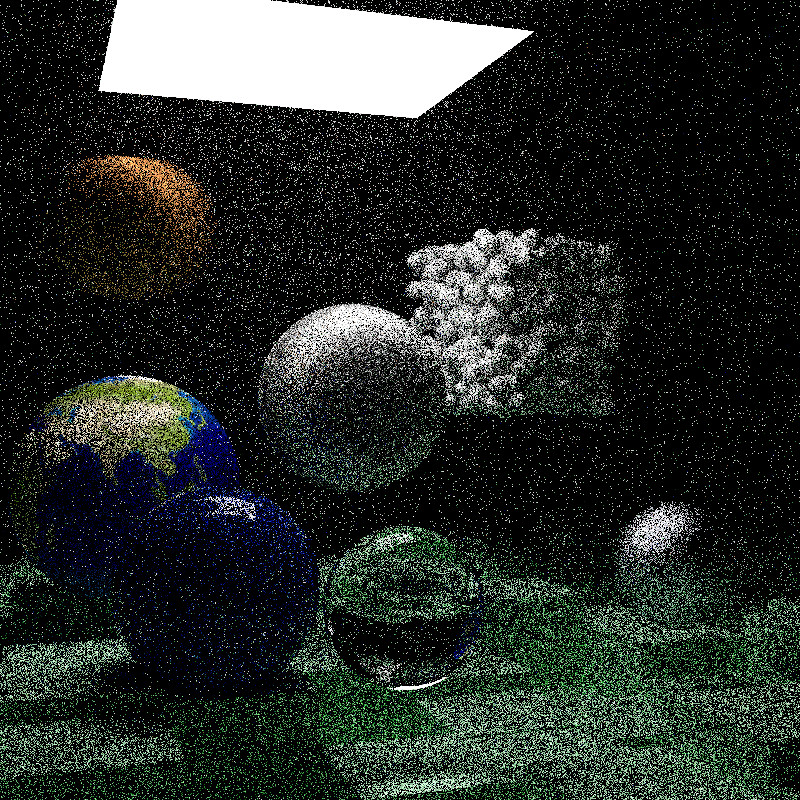
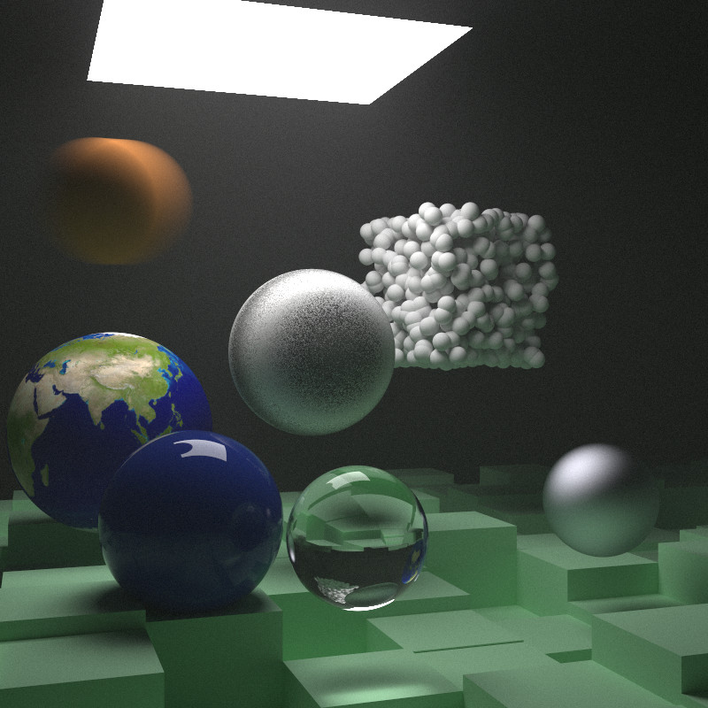

# Photon
Photon Ray-Tracer

4th Year Hons Project, aim to create a number of Ray-Tracing performance demos between various types of Ray-Tracers. Including exploration of techniques utilising DXR, primarily photon-mapping to disply Caustics.

The initial port is from Peter Shirleys RT1W serise: https://raytracing.github.io/

and the specific branch of creation is: https://github.com/PC88/CPU_RT/tree/Photon_start_branch

Inital acceleration aspects learned from Roger Allen's blog:  https://github.com/rogerallen/raytracinginoneweekendincuda

Falcor and the DXR Material learned from Chris Wyman, credit: http://intro-to-dxr.cwyman.org/

Inital update of them to VS2019, can be found here: https://github.com/PC88/dxrTutors.Code.Win10-RS5 

Initial renders of this branch are detailed below, 10 samples per pixel and 10000 samples per pixel for comparison.

jpg version:

jpg version:

